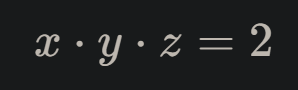

# about  

this project from April 2021 was an attempt to make an 3D equation plotter with 3 variables, similar to http://thetamath.com/app/ (which has 2 variables).  

this is the result:  

https://theta-3d.netlify.app/

<div style="display: flex; align-items: center">
	<span>
		the plot of
	</span>
	<div style="width: 10px;"></div>
	
</div>


performance is abysmal, since everything is computed on the cpu.  
a webgl version should in principle be possible, although i did not manage to make one.  


# how it works  

for each pixel, a ray is casted into the scene.  
if the ray intersects with the box, we want to figure out exactly where this ray intersects the equation surface.  
ok so what's an equation surface?  
generally if we have any equation, it has a left side and a right side and  

`[left side] = [right side]`

by rearranging we get  

`[left side] - [right side] = 0`

in our case, `[left side] - [right side]` is an expression that contains 3 variables and returns a number.  

```
function leftSideMinusRightSide(x: number, y: number, z: number): number {
  ...
}
```

we could go through each point in the box, put it into this function and check if the output is zero.  
if yes, then that point satisfies the equation and belongs to the \`equation-surface\`.  
this procedure of checking each pixel is how [thetamath](http://thetamath.com/app/) does it.  
but we can't do this because a screen is fundamentally 2 dimensional.  
we have to cast rays and intersect them with the equation surface.  
alright, so we have a line segment where the ray intersects the box.  
this line-segment defines another function, namely:  
go `R` units along the line-segment and tell me what the value of `leftSideMinusRightSide` is at that point.  
we want to find the first `R` where the value is 0.  
this is easily done with the help of newtons method or bisection.  
(if the zeroes of this function are numerous and close together, it can happen that we're not actually finding the very first, but that's mainly a concern with pathologic functions).  


now we know the first point along the ray that satisfies the equation but this is not enough.  
what we really want is to determine a color for the pixel where this ray originated.  
to that end, we can compute the surface-normal of the equation-surface at that point and then calculate a brightness-value based on its angle to a virtual sun.  

### how to compute the surface-normal:  

let p_x, p_y, p_z be the partial derivatives of some fixed function on a line-segment at its intersection with the equation surface.  
in a small neighbourhood, the value at a point that deviates from the intersection-point by (d_x, d_y, d_z) is  

p_x * d_x + p_y * d_y + p_z * d_z  

this is the dot-product of (p_x, p_y, p_z) and (d_x, d_y, d_z).  
if (d_x, d_y, d_z) lies on the equation-surface, its dot-product with the partial-derivatives-vector is zero.  
a dot-product of zero means two vectors are perpendicular. the partial-derivatives-vector is perpendicular to all surface-points close to the intersection and thus (p_x, p_y, p_z) is the surface-normal!  
no complicated calculation required.  

--- 

more sample plots:  


<div style="height: 30px;"></div>





<div style="height: 30px;"></div>


<div style="height: 30px;"></div>


<div style="height: 30px;"></div>


